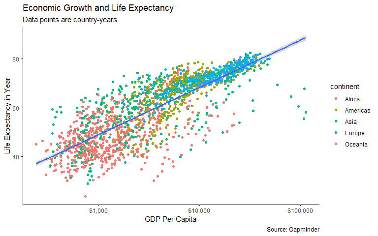
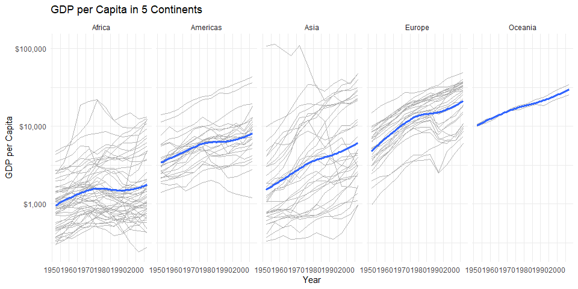
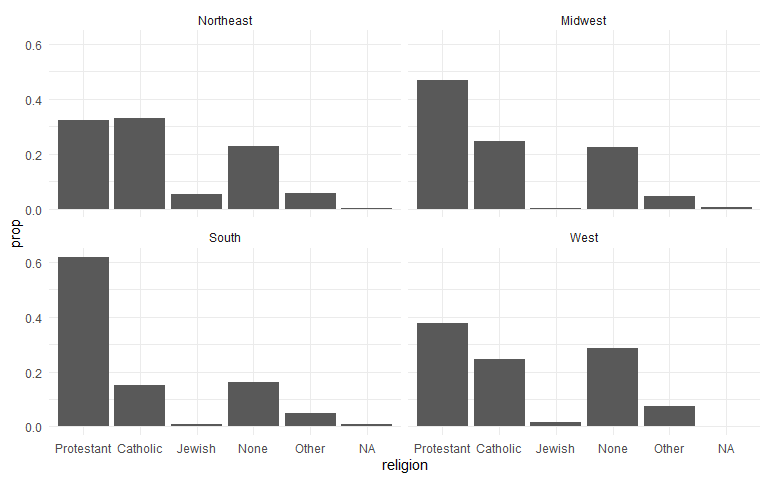
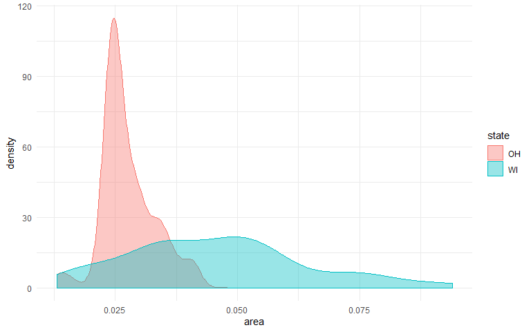
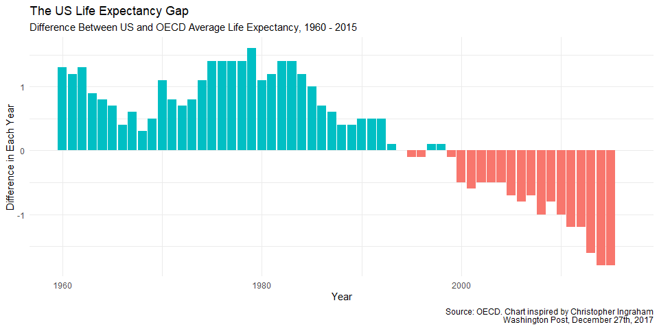
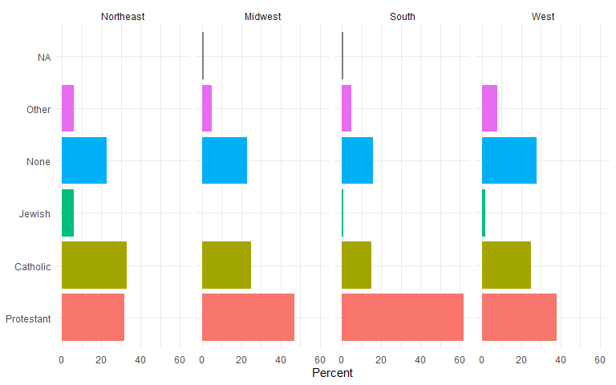

Working through socviz by Kieran Healy
================
Mason Turpin
October 3, 2018

Chapter 3
=========

Here's one of the first plots in the book. Note the use of the "scales" library to edit the x axis.

``` r
library(gapminder)
library(tidyverse)
```

    ## -- Attaching packages ---------------------------------------------------------------------------------- tidyverse 1.2.1 --

    ## v ggplot2 3.2.1     v purrr   0.3.3
    ## v tibble  2.1.3     v dplyr   0.8.3
    ## v tidyr   1.0.0     v stringr 1.4.0
    ## v readr   1.3.1     v forcats 0.4.0

    ## -- Conflicts ------------------------------------------------------------------------------------- tidyverse_conflicts() --
    ## x dplyr::filter() masks stats::filter()
    ## x dplyr::lag()    masks stats::lag()

``` r
library(socviz)
library(scales)
```

    ## 
    ## Attaching package: 'scales'

    ## The following object is masked from 'package:purrr':
    ## 
    ##     discard

    ## The following object is masked from 'package:readr':
    ## 
    ##     col_factor

``` r
gapminder
```

    ## # A tibble: 1,704 x 6
    ##    country     continent  year lifeExp      pop gdpPercap
    ##    <fct>       <fct>     <int>   <dbl>    <int>     <dbl>
    ##  1 Afghanistan Asia       1952    28.8  8425333      779.
    ##  2 Afghanistan Asia       1957    30.3  9240934      821.
    ##  3 Afghanistan Asia       1962    32.0 10267083      853.
    ##  4 Afghanistan Asia       1967    34.0 11537966      836.
    ##  5 Afghanistan Asia       1972    36.1 13079460      740.
    ##  6 Afghanistan Asia       1977    38.4 14880372      786.
    ##  7 Afghanistan Asia       1982    39.9 12881816      978.
    ##  8 Afghanistan Asia       1987    40.8 13867957      852.
    ##  9 Afghanistan Asia       1992    41.7 16317921      649.
    ## 10 Afghanistan Asia       1997    41.8 22227415      635.
    ## # ... with 1,694 more rows

``` r
p <- ggplot(gapminder, aes(gdpPercap, lifeExp)) + 
  geom_point(alpha = .3) + 
  geom_smooth(method = 'gam') +
  scale_x_log10(labels = scales::dollar)
p
```


The following graph sucks! It's got all these lines! But it's a good illustration of how aesthetics work. Notice how things you put in aes() affect variables, while things you put in geom\_point() affect the whole graph. Compare the first and second graphs.

``` r
p <- ggplot(gapminder, aes(gdpPercap, lifeExp, color = continent)) + 
  geom_point(alpha = .3) + 
  geom_smooth(method = 'gam') +
  scale_x_log10(labels = scales::dollar)
p
```


``` r
p <- ggplot(gapminder, aes(gdpPercap, lifeExp)) + 
  geom_point(alpha = .3, color = "purple") + 
  geom_smooth(method = 'gam') +
  scale_x_log10(labels = scales::dollar)
p
```


Below are two options for the final product I would choose. Note the aes() in geom\_point.

``` r
p <- ggplot(gapminder, aes(gdpPercap, lifeExp)) + 
  geom_point(alpha = .3) + 
  geom_smooth(method = 'gam') +
  scale_x_log10(labels = scales::dollar) +
  labs(x = "GDP Per Capita", y = "Life Expectancy in Year",
       title = "Economic Growth and Life Expectancy",
       subtitle = "Data points are country-years",
       caption = "Source: Gapminder") +
  theme_classic()
p
```


``` r
p <- ggplot(gapminder, aes(gdpPercap, lifeExp)) + 
  geom_point(aes(color = continent)) + 
  geom_smooth(method = 'gam') +
  scale_x_log10(labels = scales::dollar) +
  labs(x = "GDP Per Capita", y = "Life Expectancy in Year",
       title = "Economic Growth and Life Expectancy",
       subtitle = "Data points are country-years",
       caption = "Source: Gapminder") +
  theme_classic()
p
```



Chapter 4
=========

Here's the first plot from chapter 4. An introduction to facetting.

``` r
p <- ggplot(gapminder, aes(year, gdpPercap)) + 
  geom_line(color = 'gray70', aes(group = country)) +
  geom_smooth(size = 1.1, method = 'loess', se = FALSE) +
  scale_y_log10(labels = scales::dollar) +
  facet_wrap(~ continent, ncol = 5) + 
  labs(x = 'Year', y = 'GDP per Capita',
       title = 'GDP per Capita in 5 Continents') +
  theme_minimal()
p
```



Some more facetting.

    ## `geom_smooth()` using method = 'gam' and formula 'y ~ s(x, bs = "cs")'

    ## Warning: Removed 18 rows containing non-finite values (stat_smooth).

    ## Warning: Removed 18 rows containing missing values (geom_point).


This next bit was challenging. Bar charts always give me the most trouble in ggplot, but eventually we got to this facetted version to describe religion in different regions of the US. 

This graph includes a nice example of subsetting within a ggplot and shows the utility of changing alpha and using fill in density plots.

``` r
oh_wi <- c("OH", "WI")
p <- ggplot(subset(midwest, subset = state %in% oh_wi), aes(x = area, fill = state, color = state)) +
  geom_density(alpha = .4) +
  theme_minimal()
p
```



Also, one of my more repetitive ggplot2 hangups comes from forgetting stat = 'identity' in bar charts. If your data is already in the summary form of your choice, this setting allows you to graph the data as it comes without ggplot doing any of its default calculations like switching to counts.

Also, you can just use geom\_col(), which assumes stat = 'identity', instead of geom\_bar(). I will likely never remember this.

Here's an example. Note that stat and position are not aesthetics and the theme() comes *after* theme\_minimal().

``` r
p <- ggplot(titanic, aes(x = fate, y = percent, fill = sex)) +
  geom_bar(stat = 'identity', position = 'dodge') +
  theme_minimal() +
  theme(legend.position = 'top')
p
```


This is just a very nice plot to look at. Note guides(fill = FALSE) removes the legend that would normally be generated.

``` r
p <- ggplot(oecd_sum, aes(x = year, y = diff, fill = hi_lo)) +
  geom_col(position = 'identity') +
  guides(fill = FALSE) +
  labs(x = "Year", y = "Difference in Each Year",
       title = "The US Life Expectancy Gap", 
       subtitle = "Difference Between US and OECD Average Life Expectancy, 1960 - 2015", 
       caption = "Source: OECD. Chart inspired by Christopher Ingraham
       Washington Post, December 27th, 2017") +
  theme_minimal()
p
```

    ## Warning: Removed 1 rows containing missing values (geom_col).



Chapter 5
=========

Took a while to get back to this book. Had a busy couple weeks. Anyway, this chapter introduces dplyr, which is good because it's been a while for me. I generally use logical indexing, but I think dplyr, especially summarize, is better in the long run.

This first plot describes religion proportions by region.

``` r
data <- gss_sm

temp <- data %>%
  select(id, bigregion, religion) %>%
  group_by(bigregion, religion) %>%
  summarize(N = n()) %>%
  mutate(freq = N / sum(N), pct = round(freq*100, 0))
```

    ## Warning: Factor `religion` contains implicit NA, consider using
    ## `forcats::fct_explicit_na`

``` r
p <- ggplot(temp, aes(x = bigregion, y = pct, fill = religion)) +
  geom_col(pos = "dodge") + 
  labs(x = "Region", y = "Percent", fill = "Religion") +
  theme_minimal() +
  theme(legend.position = "top")
p
```


This facetted version is a bit nicer to read.

``` r
p <- ggplot(temp, aes(x = religion, y = pct, fill = religion)) +
  geom_col(pos = "dodge") + 
  labs(x = NULL, y = "Percent", fill = "Religion") +
  guides(fill = FALSE) +
  coord_flip() +
  facet_grid(~ bigregion) +
  theme_minimal()
p
```



Now into section 5.2, plotting continuous variables by group. This starts with a nice illustration of the importance of coord\_flip(), something I lean on often. I prefer the version of this plot without the fill, but it's a useful exercise regardless.

``` r
p <- ggplot(organdata, aes(x = reorder(country, donors, na.rm = TRUE), y = donors)) + theme_minimal()
p + geom_boxplot() +
  coord_flip() +
  labs(x = NULL)
```

    ## Warning: Removed 34 rows containing non-finite values (stat_boxplot).


``` r
p + geom_boxplot(aes(fill = world)) +
  coord_flip() +
  labs(x = NULL, fill = NULL) +
  theme(legend.position = "top")
```

    ## Warning: Removed 34 rows containing non-finite values (stat_boxplot).


Next is some nifty dplyr to set up the intro to Cleveland dotplots. One thing not addressed at this point is how to get counts into a table using summarize\_if(). I had to find a surprisingly complicated workaround, and I'm left wondering why there isn't a simpler way.

``` r
counts <- organdata %>%
  count(consent_law, country) %>%
  select(country, n)

by_country <- organdata %>%
  group_by(consent_law, country) %>%
  summarize_if(is.numeric, list(mean = mean, sd = sd), na.rm = TRUE) %>%
  left_join(counts, by_country, by = "country") %>%
  ungroup()

head(by_country)
```

    ## # A tibble: 6 x 29
    ##   consent_law country donors_mean pop_mean pop_dens_mean gdp_mean
    ##   <chr>       <chr>         <dbl>    <dbl>         <dbl>    <dbl>
    ## 1 Informed    Austra~        10.6   18318.         0.237   22179.
    ## 2 Informed    Canada         14.0   29608.         0.297   23711.
    ## 3 Informed    Denmark        13.1    5257.        12.2     23722.
    ## 4 Informed    Germany        13.0   80255.        22.5     22163.
    ## 5 Informed    Ireland        19.8    3674.         5.23    20824.
    ## 6 Informed    Nether~        13.7   15548.        37.4     23013.
    ## # ... with 23 more variables: gdp_lag_mean <dbl>, health_mean <dbl>,
    ## #   health_lag_mean <dbl>, pubhealth_mean <dbl>, roads_mean <dbl>,
    ## #   cerebvas_mean <dbl>, assault_mean <dbl>, external_mean <dbl>,
    ## #   txp_pop_mean <dbl>, donors_sd <dbl>, pop_sd <dbl>, pop_dens_sd <dbl>,
    ## #   gdp_sd <dbl>, gdp_lag_sd <dbl>, health_sd <dbl>, health_lag_sd <dbl>,
    ## #   pubhealth_sd <dbl>, roads_sd <dbl>, cerebvas_sd <dbl>,
    ## #   assault_sd <dbl>, external_sd <dbl>, txp_pop_sd <dbl>, n <int>
